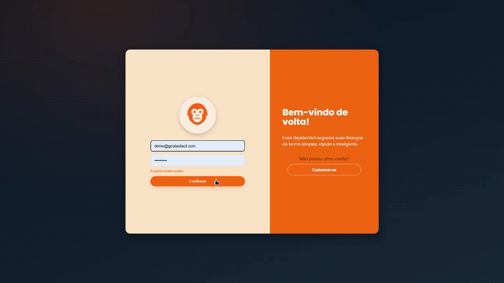
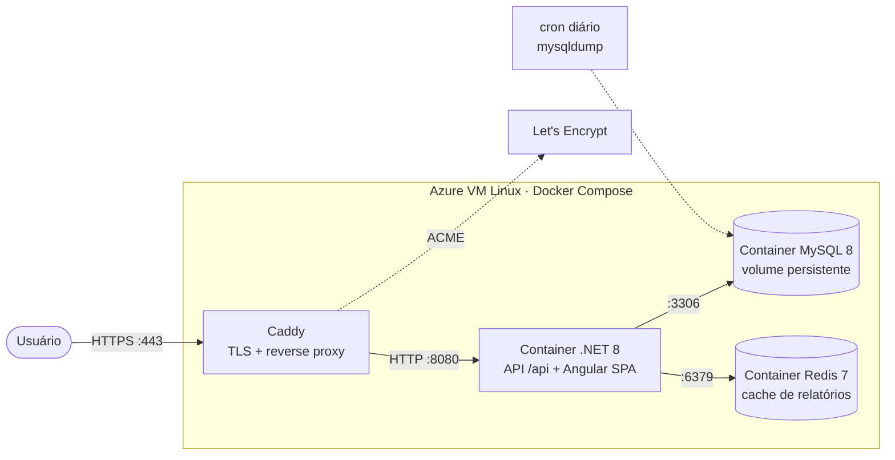

# GestãoFácil

<p align="center">
  
</p>

<p align="center">
  Sistema de controle financeiro para <b>microempreendedores</b> registrarem receitas e despesas com clareza — dashboard, relatórios e indicadores mensais.
</p>

<p align="center">
  
  
  
  
  
  
</p>

<p align="center">
  <a href="https://github.com/rafacavalcante60/GestaoFacil/actions/workflows/dotnet.yml">
    
  </a>
</p>

---

## Demonstração ao vivo

**https://gestaofacil.northcentralus.cloudapp.azure.com**

Entre com o usuário de demonstração (já vem com dados de exemplo de 3 meses):

| Campo | Valor |
|-------|-------|
| **E-mail** | `demo@gestaofacil.com` |
| **Senha** | `Demo@2026` |

> Site com HTTPS válido (certificado Let's Encrypt), hospedado no Microsoft Azure. Como é uma conta de demonstração, sinta-se à vontade para criar, editar e apagar registros.

<p align="center">
  
</p>

---

## Stack

**Frontend** — Angular 19 (SPA, servida pela própria API)
**Backend** — ASP.NET Core 8 Web API · Entity Framework Core (Pomelo) · MySQL 8
**Cache** — Redis 7 (`IDistributedCache`) para os relatórios
**Auth** — JWT + BCrypt · rate limiting por IP
**Outros** — AutoMapper · Swagger · e-mail SMTP (recuperação de senha)
**Testes** — xUnit + Moq + FluentAssertions
**Infra** — Docker (multi-stage) · Caddy (HTTPS automático) · Azure VM Linux

---

## Arquitetura do deploy

Aplicação única: o backend serve a API em `/api` **e** a SPA Angular na mesma origem (sem CORS em produção). Uma VM Linux na Azure roda três containers Docker atrás do Caddy, que termina o TLS.



**Decisões de infra que valem destacar:**

- **Caddy termina o TLS** e obtém/renova o certificado Let's Encrypt sozinho; o app fala HTTP puro na rede interna. `UseHttpsRedirection` fica só em Development e `UseForwardedHeaders` garante que o rate limiting por IP enxergue o IP real do cliente (`X-Forwarded-For`), não o do proxy.
- **Build reprodutível** via `Dockerfile` multi-stage (Node compila o Angular → SDK .NET publica → runtime enxuto), o mesmo que roda local e em produção.
- **Segredos por variável de ambiente** (fora do git), com *fail-fast*: sem `ConnectionStrings__AppDbConnectionString` ou `Jwt__Key` o app não sobe.
- **Backup do banco** via `mysqldump --single-transaction` agendado em cron, com rotação das últimas 7 cópias — o volume do MySQL é o único estado fora do versionamento.
- **Cache de relatórios com Redis:** os 4 relatórios varrem todas as despesas e receitas do usuário e agregam em memória. O resultado é guardado no Redis (`IDistributedCache`) com TTL curto e **invalidado no momento em que o usuário grava/edita/remove** uma despesa ou receita — a invalidação troca uma "versão" por usuário (O(1), sem varrer chaves). Sem Redis configurado, o app cai num cache em memória do processo, então nunca depende dele para subir.

---

## Rodando localmente

### Com Docker (recomendado — sobe tudo)

Pré-requisito: [Docker](https://docs.docker.com/get-docker/) com Compose.

```bash
git clone https://github.com/rafacavalcante60/GestaoFacil
cd GestaoFacil
cp .env.example .env      # ajuste as senhas se quiser
docker compose up --build
```

Acesse **http://localhost:8080**. O MySQL sobe junto, as migrations rodam sozinhas no startup e um usuário admin é criado a partir da variável `ADMIN_PASSWORD`.

### Sem Docker (desenvolvimento)

<details>
<summary>Passo a passo manual (.NET SDK + Node + MySQL)</summary>

Pré-requisitos: [.NET 8 SDK](https://dotnet.microsoft.com/download/dotnet/8.0), [Node.js 20 LTS](https://nodejs.org/), MySQL local.

1. Crie um banco MySQL local e renomeie `appsettings.Example.json` para `appsettings.Development.json` em `GestaoFacil.Server`, ajustando a connection string.
2. Backend, em `GestaoFacil.Server`:
   ```bash
   dotnet restore
   dotnet run --launch-profile "https"
   ```
   (se der erro de certificado: `dotnet dev-certs https --trust`)
3. Frontend, em `GestaoFacil.Client`:
   ```bash
   npm install
   ng serve
   ```

O envio de e-mail (recuperação de senha) é opcional — sem a seção `Email` configurada, o app funciona normalmente, só não envia e-mails.

</details>

---

## Funcionalidades

- Cadastro e login de usuários (JWT + hash BCrypt)
- Registro de **receitas** e **despesas** por categoria e forma de pagamento
- Dashboard com **resumo mensal**, saldo, totais de entradas e saídas
- Relatórios e indicadores financeiros, com **exportação para Excel**
- Filtros e paginação
- Recuperação de senha por e-mail

## Documentação da API

Swagger disponível em `/swagger` quando a aplicação está rodando.

---

## Roadmap

- [x] Containerização com Docker (multi-stage)
- [x] Deploy em produção com HTTPS e domínio (Azure + Caddy)
- [x] Backup automatizado do banco
- [ ] CI/CD com GitHub Actions (build → push de imagem → deploy)
- [ ] Cache distribuído com Redis
- [ ] Infraestrutura como código (Terraform)
